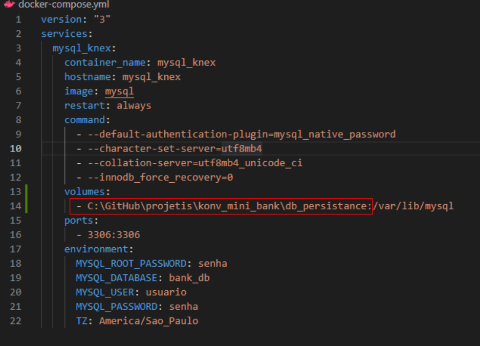

# Konv Mini Bank


## **Installation**

### Make sure you have docker, docker-composed and git installed on your machine by typing in your command prompt: 

&nbsp;
```
python --version
docker -v
docker-compose -v
git --version
pip --version
```

### It should provide the installed versions. If any of them is not available to the system yet, install it beforehand.


&nbsp;

### Clone the repository with source code.

```
git clone https://github.com/aogdrummond/konv_mini_bank.git
```
&nbsp;

### Change working directory to app's.

```
cd konv_mini_bank
```

&nbsp;
### Create virtual environment.
```
python -m venv konv_bank_venv
```
&nbsp;


### Activate the virtual environment.

```
konv_bank_venv\Scrips\activate [Windows] 
or
konv_bank_venv\bin\activate [Linux/Mac] 
```
&nbsp;
### Install virtual environment dependencies.
```
pip install -r requirements.txt
```
&nbsp;

### Only in the case you are interest on persisting database's data when its container stops, inserts the field "volumes" like in the example below, in the following order:

```
 volumes:
     - path\to\storage\folder:/var/lib/mysql 
```
### The folder to storage must be empty.

&nbsp;



### If you aren't interested on persistance, the file may remain unchanged

&nbsp;
### Download image and run container.
```
docker-compose up
```
Tip: To acess the images available on DockerHub you need to be logged in to Docker. The quickest way on Windows is by installing Docker Desktop.

&nbsp;
### After those steps, the container with the database should be running and connected to your system, and the aplication is ready to run.


&nbsp;


## **How to use**
* ### To start it on your console, just run "main.py" file:

```
python main.py
```

* ### To use it just follow the commands in the console, like in the example below: 

&nbsp;


